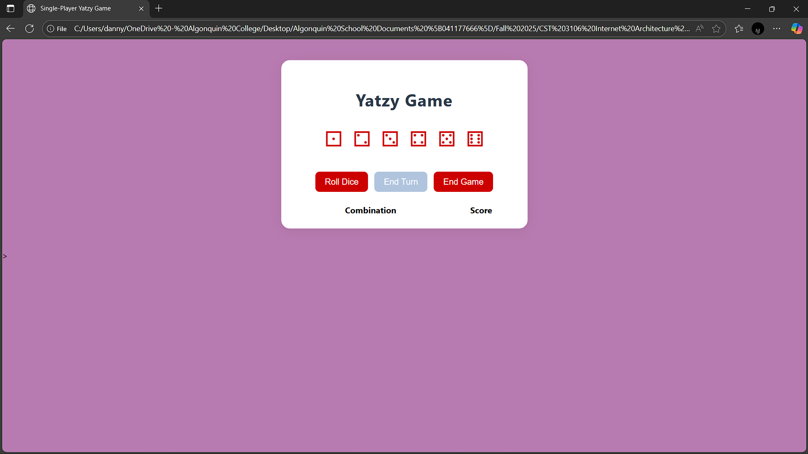

# Yatzy Mockup  Lab 5 

## Overview
This is a single-player implementation of Yatzy (a dice rolling game) using HTMLand CSS and. Yatzy can be played solitaire or by any number of 
players. Players take turns rolling five dice.After each roll, the player chooses which dice to keep, and which to reroll. A player may reroll 
some or all of the dice up to two times on a turn. The player must put a score or zero into a score box each turn. The game ends when all score boxes are used. The player with the highest total score wins the game.

The maximum score is 374 (5 on the Ones, 10 on the Twos, 15 on the Threes, 20 on the Fours, 25 on the Fives, 30 on the Sixes, the 50 point bonus, 12 on the One Pair, 22 on the Two Pairs, 18 on the Three of a Kind, 24 on the Four of a Kind, 15 on the Small Straight, 20 on the Large Straight, 28 on the Full House, 30 on the Chance, and 50 on the Yatzy).

## Color Scheme
The game utilizes a cool, muted palette to ensure readability and a professional appearance.
-   **Background Color:** Purple #b87bb1
-   **Main Text:** Black #0000 
-   **Button Color:** Red #cd0000
-   **Button Text-Color:** white #ffff

**Reason why?** I use purple for my portfolio and it looked good, gave it a nice cool, dark, humming vibe. So i decided to add the same vibe to the game

## Font
I used the Segoe Ui Font

**Reason why?:** The font is firm, consistent, and easy to read, i''d have loved to use times new roman but i'd rather not. 

!!! I have yet to create a detailed score and combinations, but i have created their classes and filled them with titles !!!

### This is a screenshot of my mockup game
