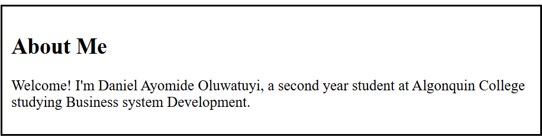
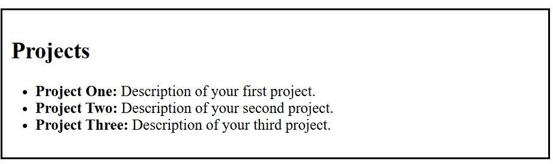
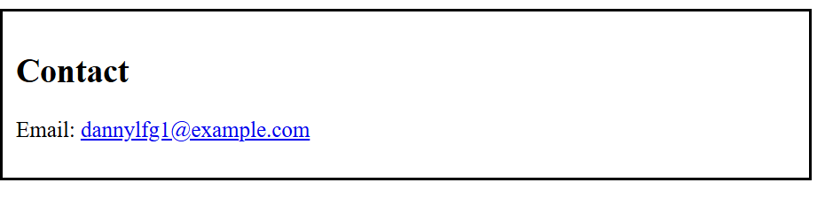

# **Daniel Ayomide Oluwatuyi's Portfolio Design System Documentation**
This is the markdown file for my portfolio

## *1. Color Palette*
The colors used for each section is listed below

- Text Color: `#000000`
- Secondary Text Color: 'fff'
- Header Color: `00948d`
- Footer Color: `00948d`
- Background Color: `#fff`
- Nav Background Color: `#727272`

## **2. Typography**
- Body Text: `"Times New Roman", Times, serif`

# ***3. Components and Layout**
## Header
- **Design:** Centered text with a dark grey=enish-blue background and white colored text.
- **Mock-up Screenshot:**

## Navigation
- **Design:** Grey background with white text links.
- **Mock-up Screenshot:**

## About Me
- **Design:** Times new roman font, with detail about daniel(me) and a black border
- **Mock-up Screenshot:**

## Projects
- **Design:** Times new roman font, with detail about danie;s projects and a black border
- **Mock-up Screenshot:**

## Contact
- **Design:** Times new roman font, with daniels(me) contact methods and a black border
- **Mock-up Screenshot:**

### Footer
- **Design:**  Centered text with a dark greenish blue background and white text.
- **Mock-up Screenshot:**

